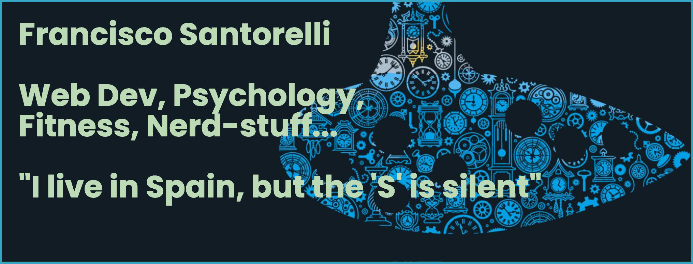

# Gavaar

## Summary

I'm a web developer who went crazy and changed his career a few years ago. Now, I have become really passionate about the Javascript and Typescript world, having worked with different technologies on professional companies as well as stupid (and some not-as-much) personal projects.

## Some stats about me

    
    
    
    

    

> <small>*Do note these stats do not include current workload, as those commits are hosted somewhere else*</small>

## About me

> No pain au chocolat, no gain au chocolat

I'm a nerd on various subjects. I studied (and graduated) Psychology with a specialization in Behavioral Sciences. Worked a little bit as student in several areas, but I didn't find passion in clinical work, I required a little bit more of abstract problem-solving.

After moving to Spain, I decided to jump deep into learning development. And a few years later, here I am, a web developer that found joy in crashing his head against code problems!

### Web development

After I got my head wrapped around the idea of having to learn to code. I went into [codecademy](https://codecademy.com) and started doing the HTML, CSS and Javascript courses. Then I applied in coursera to a MEAN stack basic initiation course (Mongo, Angular, Express, Node), and started dwabbling around with my newfound knowledge in some personal projects, and later some quick freelance component fixings and creatings.

I learned  HTML,  CSS,  Javascript
,  Typescript,  Express,  Angular and some  Node in a very basic level before landing my first professional job.

### Psychology

Even though I did not enjoy the professional aspects of Psychology, I did really enjoy learning about behavioral sciences and all-things related to human behavior. Human consumer behavior and human biological impulses and it's effects on psychology and sociology are things that to this day catches my interest. Currently, I'm trying to summarize all I have learned (without citing or ademic-related stuff) in a single place in which I can update what I find with the latest information on Human Behavior.

### Nutrition / Fitness

This is another area in which I did not think I'd end up diving into. I started learning about this for the wrong purposes (trying to look better, etc). But down the road have learned a lot about nutrition, exercising, the ways muscles develop in different areas (energy / mechanical), and how eating one thing or another affects your ability to deliver in other very-unrelated areas. Glycemic index / Insulin response / Fasting, etc. As the day of this writing: I'm trying to live a live with low carb diet (it's not a 0-carb diet though), and a heavy focus on strength-training (meaning, getting them muscles harder, not bigger).

### Gaming

I have played games since I have memory. This is all my dad's fault. Also, I do think games helped me develop my cognitive abilities so I think I will be gaming until I die. In this sense: at the time of this writing, you cand find me playing stuff like Stardew Valley, Dota2, Age of Empires IV, Elden Ring, and what not.

### Music

Lately I've been going crazy about festivals. So, if possible, I'd like to attend as many as I can in the coming years. Here's some of the things I've been listening to:

## Education

    
    

        <strong>Bachelors in Psychology (2012-2017)</strong>
         
        Five year career plan, for which three correspond to general knowledge, and the last two were for the specialization of Behavioral Sciences. Including internship, social services, and a dissertation.
    

 

    
    

        <strong>Placeholder</strong>
         
        Lorem ipsum
    

## You made it this far?? Wow, thanks for reading! :)

