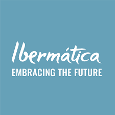

# Gavaar

> <small>*Image taken from [here](https://www.e-flux.com/architecture/positions/191258/is-ornamenting-solar-panels-a-crime/)*.</small>

<!-- ## Fran -->

Programming since 2018. Mostly with 
 
Angular,

React, 

Rails, 

Rust in the mix. 
Currently focusing in Rust for fun.

---

I'm a Web Developer that believes the best code is written by humans (at least for now).
Studied Psychology with an emphasis on Behavioral Analysis, and a dissertation on Consumer Psychology.
Transitioned to become a Developer in 2018 after moving to Spain. Learned through Codecademy and Coursera.

*I'm thankful to everyone that has tutored me along the way in both disciplines, as I would not be here without them.*

I believe to bridge the gap between Front-End development and User Experience by mixing my knowledge in Web Development and Behavioral Sciences.
I have a growing interest in the Rust ecosystem and it's applications.
Personal projects are mainly built with Rust / Typescript.

I like challenging myself and learning. Teaching is a way of learning and staying up to date.

## Internet brownie-points
<!-- 

 -->

    

    

    

<!-- ## Some things I've done that make me proud:
**Work related**
- Reworked features of an app to work declaratively for easier maintenance (declarative > imperative)
  - I actually enjoy doing this. So I've done it a few times.
- Dusted geometry to do some calculations for positioning texts, and setting widths, on dynamic charts.
- Created a class that selected files (in-app) similar to how OS do it (holding shift selects all those in between current selection and the one clicked. Holding control toggles the selection of a single one, etc).
- Implemented a map library with an API to offer physical ad billboards to clients.
- Broke down a script which handled GDPR Cookies modal which was about ~500 lines long in a single JS file and was hard to reason about (Separated concerns, reused repeated logic, reduced amount of duplicated config declarations, etc.).
- Was given the full responsability of remaking the Front-end for a product of Equifax (an American loan-tracking app). And was praised on the outcome, which was nice at the time for the experience I had.
- Used Nativescript for a multi-platform app! (would now use Flutter though).
- This github readme 😁.

**Personal stuff that highlights I'm a nerd**
- [Advent of Code 2023](https://github.com/gavaar/aoc_2023). I actually did almost all of the days (in Rust, to learn the language a bit). It was fun. I'll attempt a full completion in 2024.
- Created a profit-calculator to save time in a video game (I know). It included calling the API of the game's Auction House, and checking prices for materials, goods and selling taxes, to calculate the profitability of selling said thing for the day. Honestly it was a cool [personal project](https://github.com/gavaar/wow-boneshatter).
- Gym tracking app. I was doing a type of training in which weights went up after a series of conditions met on previous trainings. So I created an app that would do that for me automatically (currently offline, as I plan to redo it, but here's [the repo](https://github.com/gavaar/gym_periodization)).
- A script to check unfollowers on instagram. It's private because I believe it's against instagrams TOS to have this public. But I'm using their own endpoints and website so.. all fair.
- Created a chat feature using websockets for an app in a personal project.
- This [No Man's Sky script](https://github.com/gavaar/nms-stew-giver) to auto click.. I'm lazy.
- Played [screeps](https://github.com/gavaar/screeps) at one point.
- Created a header that animates while collapsing / expanding. It's silly but fun, can be seen [here](https://gavaar-blog.web.app/enk/non_zero_days) (personal blog-ish website).
- Previously mentioned personal blog-ish website. -->

<!-- ## About me -->
<!-- > No pain au chocolat, no gain au chocolat - Someone, somewhere.

I studied Psychology at UCV (Universidad Central de Venezuela, which by the way is the best university in the world[1]).
I graduated with a specialization in Behavioral Sciences and disertation in Consumer Psychology.
Very fun stuff.
I'd summarize that knowledge into: how people gets programmed into their habits and misbehaviors.

Nonetheless, that degree (emphasis: the degree. NOT the knowledge) is now useless to me.

I moved into Spain and looked into ratifying said degree.
I quickly discovered it was a daunting and expensive goal.
Plus I did not really find joy in the role of a Clinical Psychologist — nothing against it, it just wasn't for me.

So I had to choose between investing time, money and effort into a career which I loved but didn't find fulfilling or...
not do that at all and improvise. And I did the latter. Fuck my degree.

I knew I could enjoy the development world so I decided to go and learn HTML, CSS & Javascript.
At first I sucked at it and got very frustrated.
Now I don't get frustrated.
Eventually this became my career, and am currently working as a Front-End Developer. -->

<!-- <small>1. Source: my biased opinion</small> -->

<!-- ## _More_ random info about me: -->

<!-- WEB DEVELOPMENT -->

<!-- PROFESSIONAL EXPERIENCE -->

<h3 cursor="pointer">👨‍💻&nbsp;Experience</h3>

    <strong><a href="https://www.rubiconmd.com/">RubiconMd</a> (Dec 2022 - Curent)</strong>
    

        &nbsp;
        &nbsp;
        &nbsp;
        &nbsp;
    

    
Architectural refactors, code reusability and removal of tech debt in a product that lived up-to-date with modern practices with the latest Angular version: removing deprecated pieces ahead of the curve, and implementing new stable features to keep a fresh product. Bootstraped a scratch idea using React-native to bring users closer to the business, rapidly gauging interest from stakeholders

    <strong><a href="https://www.dynatrace.com/">Dynatrace</a> (Jul 2022 - Nov 2022)</strong>
    

        &nbsp;
        &nbsp;
        &nbsp;
        &nbsp;
        &nbsp;
    

    
Rapidly integrated into a new React-based team within 6 months in a period of organizational transition. Built high-performing graphs for a massive product used across the globe.

    <strong><a href="https://platform161.com/">Platform161 (Verve-DSP)</a> (Jul 2019 - Jun 2022)</strong>
    

        &nbsp;
        &nbsp;
        &nbsp;
        &nbsp;
        &nbsp;
        &nbsp;
    

    
Strong Front-End product built with Angular and kept up-to-date with modern practices in mind, while building rails pieces on the side. Key contributor on a DSP platform which in addition to team effort led to an acquisition by the Verve Group. Complex architectural decisions and refactors were needed at times, given the complexity of the product against the demands of the market.

    <strong><a href="https://ibermatica.com/">Ibermatica</a> (Dec 2018 - Jun 2019)</strong>
    

        &nbsp;
        &nbsp;
        &nbsp;
        &nbsp;
    

    
Given the opportunity to rebuild a Front-End from scratch by myself, took the opportunity which resulted in a successful delivery and 100% client satisfaction. Afterwards was entrusted with mentoring a Junior developer while only having a year of experience myself.

    <strong><a href="https://voiping.es/">Voiping US</a> (Jul 2018 - Dec 2018)</strong>
    

        &nbsp;
        &nbsp;
        &nbsp;
        &nbsp;
    

    
First hands-on experience as a web-developer. Implementation of Design principles and good programming practices. In-depth Angular since v4. CSS with flexbox and grid. Created some scripts in Typescript

<!-- EDUCATION -->

<h3 cursor="pointer">📚&nbsp;Education</h3>

    <strong>Bachelors in Psychology (2012-2017)</strong>
    
Three years of general studies in psychology as foundation plus two more years specializing in Behavioral Sciences with a focus on clinical practice. Disertation built on Consumer Psychology and it's relation to interpersonal dynamics  
    

    <strong>Online Specialization on MEAN Stack (Angular) (2018-2019)</strong>
    
Specialization on Mongo, Express, Angular and Node stack, with a big focus on Angular and Express. It used Angular v4.0 at the momment and included Ionic and Nativescript modules as well.  
    

## Other interests

<!-- PSYCHOLOGY -->

🧠&nbsp;Psych

The biggest problem with psychology for me was its career paths. From which the only one that caught my attention was Academic research, but I'm divorced from Academia now. It was a toxic relationship.

I did really enjoy learning about behavioral sciences and all-things related to human behavior. Human consumer behavior and human biological impulses and it's effects on psychology and sociology are things that to this day catches my interest and was the basis for my dissertation to opt for the degree.

I'm trying to summarize all I have learned in a single place.

<!-- NUTRITION / FITNESS -->

🏋️&nbsp;Nutrition / Fitness

This is another area in which I did not think I'd end up diving into... aaand here we are.

I've used myself as my own control group. Have tried keto diets, low-carbs, no-sugar, no-coffee, full-coffee, controlling glycemic index, etc. I am somehow still alive. I'm also an idiot, don't do this at home.

Started learning about for aesthetics. It shifted into me trying to get my body to be as stoic as possible for the longest time possible. We're all gonna die anyways, so let's just maximize that time in here.

Currently trying some type of [low-carb diet](https://en.wikipedia.org/wiki/Low-carbohydrate_diet) and focusing on strength training (akin to [powerlifting](https://en.wikipedia.org/wiki/Powerlifting) but not quite). Rather live strong than die weak.

<!-- GAMING -->

🎮&nbsp;Gaming

I have played games since I have memory. This is all my dad's fault (I thank him for it!).

I attribute some of my abilities to video games, so I think I will be gaming until I die. Nonetheless, games that do not take me to any mental limit or are not enterntaining, feel like a waste of time (at least for me).

Here's what I've been playing lately. Do judge me:

    

<!-- MUSIC -->

🎶&nbsp;Music

If I limit my music to what I've always liked, I'd be missing on a lot of great things I have never given the chance to enjoy. If you're reading this just send me a song suggestion, I'll hear it.

    

---
---

    
    
    
    

