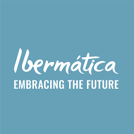
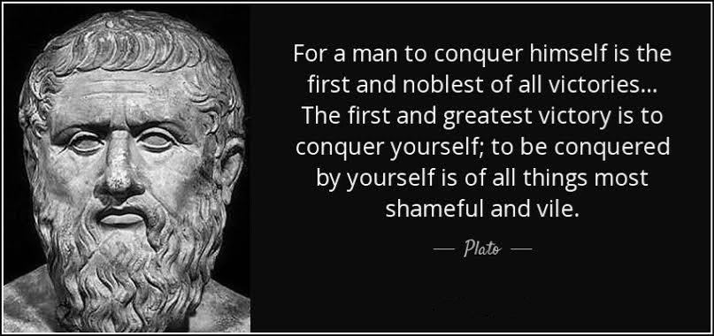

# Gavaar

> <small>*Image taken from [here](https://www.e-flux.com/architecture/positions/191258/is-ornamenting-solar-panels-a-crime/)*.</small>

<!-- ## Fran -->

Web developer since 2018, primarily working with
 
Angular,

React, 

Rails, with some

Rust. 
Currently exploring Rust, Convex through personal projects.

---

I focus on building readable, maintainable software that can evolve without unnecessary complexity.
Before moving into development, I studied psychology with an emphasis on behavioral analysis and wrote my dissertation on the relationship between consumer psychology and interpersonal attraction.

I transitioned into web development after moving to Spain in 2018, learning through Codecademy, Coursera, and hands-on personal projects. My background in behavioral science continues to inform how I think about user experience.

I am currently developing my knowledge of the Rust ecosystem, and most of my personal projects use Rust or TypeScript.

<!-- ## Internet brownie-points

    

    

    

 -->

<!-- ## Some things I've done that make me proud:
**Work related**
- Reworked features of an app to work declaratively for easier maintenance (declarative > imperative)
  - I actually enjoy doing this. So I've done it a few times.
- Dusted geometry to do some calculations for positioning texts, and setting widths, on dynamic charts.
- Created a class that selected files (in-app) similar to how OS do it (holding shift selects all those in between current selection and the one clicked. Holding control toggles the selection of a single one, etc).
- Implemented a map library with an API to offer physical ad billboards to clients.
- Broke down a script which handled GDPR Cookies modal which was about ~500 lines long in a single JS file and was hard to reason about (Separated concerns, reused repeated logic, reduced amount of duplicated config declarations, etc.).
- Was given the full responsability of remaking the Front-end for a product of Equifax (an American loan-tracking app). And was praised on the outcome, which was nice at the time for the experience I had.
- Used Nativescript for a multi-platform app! (would now use Flutter though).
- This github readme 😁.

**Personal stuff that highlights I'm a nerd**
- [Advent of Code 2023](https://github.com/gavaar/aoc_2023). I actually did almost all of the days (in Rust, to learn the language a bit). It was fun. I'll attempt a full completion in 2024.
- Created a profit-calculator to save time in a video game (I know). It included calling the API of the game's Auction House, and checking prices for materials, goods and selling taxes, to calculate the profitability of selling said thing for the day. Honestly it was a cool [personal project](https://github.com/gavaar/wow-boneshatter).
- Gym tracking app. I was doing a type of training in which weights went up after a series of conditions met on previous trainings. So I created an app that would do that for me automatically (currently offline, as I plan to redo it, but here's [the repo](https://github.com/gavaar/gym_periodization)).
- A script to check unfollowers on instagram. It's private because I believe it's against instagrams TOS to have this public. But I'm using their own endpoints and website so.. all fair.
- Created a chat feature using websockets for an app in a personal project.
- This [No Man's Sky script](https://github.com/gavaar/nms-stew-giver) to auto click.. I'm lazy.
- Played [screeps](https://github.com/gavaar/screeps) at one point.
- Created a header that animates while collapsing / expanding. It's silly but fun, can be seen [here](https://gavaar-blog.web.app/enk/non_zero_days) (personal blog-ish website).
- Previously mentioned personal blog-ish website. -->

<!-- ## About me -->
<!-- > No pain au chocolat, no gain au chocolat - Someone, somewhere.

I studied Psychology at UCV (Universidad Central de Venezuela, which by the way is the best university in the world[1]).
I graduated with a specialization in Behavioral Sciences and disertation in Consumer Psychology.
Very fun stuff.
I'd summarize that knowledge into: how people gets programmed into their habits and misbehaviors.

Nonetheless, that degree (emphasis: the degree. NOT the knowledge) is now useless to me.

I moved into Spain and looked into ratifying said degree.
I quickly discovered it was a daunting and expensive goal.
Plus I did not really find joy in the role of a Clinical Psychologist — nothing against it, it just wasn't for me.

So I had to choose between investing time, money and effort into a career which I loved but didn't find fulfilling or...
not do that at all and improvise. And I did the latter. Fuck my degree.

I knew I could enjoy the development world so I decided to go and learn HTML, CSS & Javascript.
At first I sucked at it and got very frustrated.
Now I don't get frustrated.
Eventually this became my career, and am currently working as a Front-End Developer. -->

<!-- <small>1. Source: my biased opinion</small> -->

<!-- ## _More_ random info about me: -->

<!-- WEB DEVELOPMENT -->

<!-- PROFESSIONAL EXPERIENCE -->

<h3 cursor="pointer">👨‍💻&nbsp;Professional Experience</h3>

    <strong><a href="https://www.rubiconmd.com/">RubiconMd</a> (Dec 2022 - May 2026)</strong>
    

        &nbsp;
        &nbsp;
        &nbsp;
        &nbsp;
    

    
Modernized an Angular product through architectural refactors, reusable abstractions, and technical debt reduction. Removed deprecated APIs and adopted stable framework features as the product moved to new Angular versions. Built a React Native prototype with Expo and Nativewind to evaluate a product idea and gather early stakeholder feedback.

    
Adopted AI-assisted tooling to improve development speed while retaining code review and quality controls.

    <strong><a href="https://www.dynatrace.com/">Dynatrace</a> (Jul 2022 - Nov 2022)</strong>
    

        &nbsp;
        &nbsp;
        &nbsp;
        &nbsp;
        &nbsp;
    

    
Joined a React team during a period of organizational transition and built performant data visualizations for a global observability platform.

    <strong><a href="https://platform161.com/">Platform161 (Verve-DSP)</a> (Jul 2019 - Jun 2022)</strong>
    

        &nbsp;
        &nbsp;
        &nbsp;
        &nbsp;
        &nbsp;
        &nbsp;
    

    
Developed and maintained an Angular front end for a demand-side advertising platform, with additional contributions to its Rails codebase. Worked on architectural decisions and refactors to keep the product maintainable as its requirements evolved. The company was later acquired by Verve Group.

    <strong><a href="https://ibermatica.com/">Ibermatica</a> (Dec 2018 - Jun 2019)</strong>
    

        &nbsp;
        &nbsp;
        &nbsp;
        &nbsp;
    

    
Independently rebuilt a front end and delivered it successfully to the client. I was subsequently asked to mentor a junior developer for future projects.

    <strong><a href="https://voiping.es/">Voiping US</a> (Jul 2018 - Dec 2018)</strong>
    

        &nbsp;
        &nbsp;
        &nbsp;
        &nbsp;
    

    
Started my professional web development career working with Angular, TypeScript, and modern CSS, including Flexbox and Grid.

<!-- EDUCATION -->

<h3 cursor="pointer">📚&nbsp;Education</h3>

    <strong>Bachelor's degree in Psychology (2012-2017)</strong>
    
Completed three years of general psychology followed by two years specializing in behavioral science, with a focus on clinical practice. My dissertation examined the relationship between consumer psychology and interpersonal attraction.  
    

    <strong>Online specialization in the MEAN stack (2018-2019)</strong>
    
Coursework in MongoDB, Express, Angular, and Node.js, with an emphasis on Angular and Express. The program also included Ionic and NativeScript modules.  
    

    <strong>LinkedIn Learning & Credentials</strong>
    
Rust essential training <a href="https://www.linkedin.com/learning/certificates/01ad9457bc80c228cd4be3a0c8a08640a474281b738380426d47cfe8405c7848?lipi=urn%3Ali%3Apage%3Ad_flagship3_profile_view_base%3BvPDkRiKTT%2FOd6emP2mHO2w%3D%3D" target="_blank">[Jun 2023]</a>

    
Learning S.O.L.I.D. programming principles <a href="https://www.linkedin.com/learning/certificates/6f7193e9ed730688243a8ac033f903928ddbb1ccd79a3453c2630f0e54733b20?trk=backfilled_certificate&lipi=urn%3Ali%3Apage%3Ad_flagship3_profile_view_base%3BvPDkRiKTT%2FOd6emP2mHO2w%3D%3D" target="_blank">[Jul 2021]</a>

    

     

## Other interests

<!-- PSYCHOLOGY -->

<h3>🧠&nbsp;Psych</h3>

I remain interested in how people interact with the world around them and how behavioral insights can support personal development.

    

<!-- NUTRITION / FITNESS -->

<h3>🏋️&nbsp;Nutrition / Fitness</h3>

I practice strength training using the [Greyskull method](https://www.powerliftingtowin.com/greyskull-lp/) and read about nutrition, recovery, and sleep. Learning through consistent practice has helped me make more informed long-term decisions about my health.

    

<!-- GAMING -->

<h3>🎮&nbsp;Gaming</h3>

I appreciate video games as a medium that brings together visual design, music, storytelling, and interaction.

    

<!-- MUSIC -->

<h3>🎶&nbsp;Music</h3>

I listen to a wide range of music and always welcome recommendations or a Spotify Blend.

    

---
---

    
    
    
    

